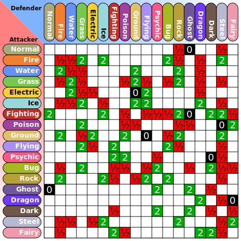
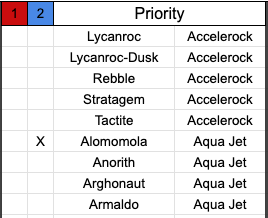

+++
title = "Prolog Basics Explained with Pokemon"
description = "Demonstrating the basics of logic programming with data from the Pokemon games."
date = 2026-01-05
+++

<style>
.inline-figure {
  display: flex;
  justify-content: space-around;
  margin: 1rem;
}

.move {
  text-transform: lowercase;
  font-variant-caps: small-caps;
}

pre[data-name=top-level] {
  /*
   * Trust me I'm not proud of this, but Zola, the static-site generator I'm using,
   * inserts the code block background-color as a "style" attribute on the <pre> tag.
   * I can either break open my Zola syntax highlighting implementation or I can suck it up
   * and use the !important tag. I do still feel the need to acknowledge it though.
   * Call it a point of professional pride.
  */
  background-color: var(--aside-color) !important;
}

figure img {
  margin: 0 auto;
}
</style>

The project that inspired this post is a little silly—I am about to describe the mechanics of a children's video game in great detail—but this particular problem is what finally made Prolog click for me, an epiphany I've been hunting for ever since reading Bruce Tate's "Seven Languages in Seven Weeks."

This exercise has taught me a lot about the kinds of interfaces I'm trying to build in [somewhat more practical domains](https://alexanderpetros.com/triptych/).
For certain kinds of relationships, logic programming is by far the most concise and expressive programming system I've ever used.

To understand why, let's talk about Pokemon.


## Pokemon basics

Pokemon is a video game series/multimedia franchise/lifestyle brand set in a world where humans live alongside a menagerie of colorful animal characters.

"Pokemon" is both the name of the franchise and the generic term for the animal characters themselves, which all have their own individual species names.
There are over a thousand distinct species of Pokemon, from Bulbasaur ([#1](https://bulbapedia.bulbagarden.net/wiki/Bulbasaur_(Pok%C3%A9mon))) to Pecharunt ([#1025](https://bulbapedia.bulbagarden.net/wiki/Pecharunt_(game))).

<figure>
  <div class="inline-figure">
    
    
    
  </div>
  <figcaption>
    Popular Pokemon include (from left to right):<br>
    Pikachu <a href="https://bulbapedia.bulbagarden.net/wiki/Pikachu_(Pok%C3%A9mon)">(#25)</a>, Archeops
    <a href="https://bulbapedia.bulbagarden.net/wiki/Archeops_(Pok%C3%A9mon)">(#567)</a>
    , and Dipplin <a href="https://bulbapedia.bulbagarden.net/wiki/Dipplin_(Pok%C3%A9mon)">(#1101)</a>.
  </figcaption>
</figure>

<aside>I rarely include images on this blog and I am very excited that this post warrants them.</aside>

There are all sorts of Pokemon games now, but the main series has always been about catching and battling them.
During a battle, your team of six Pokemon faces off against another team.
Each Pokemon is equipped with four moves that it can choose to (usually) do damage to their opponent.
You need to reduce the HP (Hit Points) of all your opponent's Pokemon to zero before they are able to do so to you.

Each Pokemon has unique traits that affects how it battles.
They have a set of base stats, a large pool of possible moves, a handful of abilities, and a typing.
As you will see in a moment, the immense number of combinations here is the motivation for trying to track this with software.

<figure>
  
  <figcaption>Scizor is a Bug/Steel type with high Attack and low Speed (via <a href="https://www.smogon.com/dex/bw/pokemon/scizor/">Smogon</a>)</figcaption>
</figure>

<aside>
Speed controls which move will go first;
Attack and Special Attack affect how much damage they do with Physical and Special moves, respectively;
Defense and Special Defense affect how much damage they take.
</aside>

Typing is especially important.
Moves have a type, like Fire or Rock, and Pokemon can have up to two types.
A move with a type that is Super Effective against the opposing Pokemon will do double damage; a move that is Not Very Effective will do half damage.

It's a little more intuitive with examples.
The Fire-type move <span class="move">Flamethrower</span> will do 2x to Grass-type Pokemon, because Grass is weak to Fire, but the Water-type move <span class="move">Surf</span> will only do &half; damage to them, because Grass resists Water.

<figure>
    
  <figcaption>
    <a href="https://bulbapedia.bulbagarden.net/wiki/Lunatone_(Pok%C3%A9mon)">Lunatone</a> is a Rock/Psychic Type. Rock is weak to Water, and Psychic is neutral to it, so <span class=move>Surf</span> will do 2x damage.
  </figcaption>
</figure>

Type modifiers can stack.
<a href="https://bulbapedia.bulbagarden.net/wiki/Scizor_(Pok%C3%A9mon)">Scizor</a> is a Bug/Steel type, and *both* Bug and Steel are weak to Fire, so Fire moves will do 4x damage to Scizor.
Electric is weak to Water, but Ground is immune, so if you use an Electric type move against Water/Ground [Swampert](https://bulbapedia.bulbagarden.net/wiki/Swampert_(Pok%C3%A9mon)), you'll do zero damage, since 0&times;2 is still 0.

Naturally, there is a chart to help you keep track.

<figure>

<figcaption>
  Pokemon Type Chart (via <a href="https://commons.wikimedia.org/wiki/File:Pokemon_Type_Chart.svg">Wikimedia</a>)
</figcaption>
</figure>

Those are effectively the mechanics of the Pokemon video games as I understood them when I was 8.
Click moves to do damage, try to click moves with good type matchups.
These games are for children and, at the surface level, they're not very hard.

## Prolog basics

Before I explain how wonky the Pokemon mechanics can get under the hood, I first need to explain how logic programming works.
Pokemon is a great fit for logic programming because Pokemon battles are essentially an extremely intricate rules engine.

Let's start by creating a file with a bunch of facts.

```prolog
pokemon(bulbasaur).
pokemon(ivysaur).
pokemon(venusaur).
pokemon(charmander).
pokemon(charmeleon).
pokemon(charizard).
pokemon(squirtle).
pokemon(wartortle).
pokemon(blastoise).
```

In Prolog, we declare "predicates."
Predicates define relationships: `bulbasaur` is a `pokemon`, `charmander` is a `pokemon`, and so on.
We refer to this predicate as `pokemon/1`, because the name of the predicate is `pokemon` and it has one argument.

These facts are loaded into an interactive prompt called the "top-level."
You query the top-level by typing a statement into the prompt;
Prolog tries to find all the ways to make that statement true.
When there's more than one possible solution, the top-level displays the first solution and then awaits user input.
You can then have it display one more solution, all the solutions, or stop entirely.

In this first example, we type `pokemon(squirtle).` and hit Enter.
The top-level replies `true.`
[Squirtle](https://bulbapedia.bulbagarden.net/wiki/Squirtle_(Pok%C3%A9mon)) is, in fact, a Pokemon.

```name=top-level
?- pokemon(squirtle).
   true.
```

<aside>
  If you want to follow along at home, check out <a href="https://github.com/alexpetros/prologdex">the repo</a>, which has quick setup instructions.
</aside>

Not all things are Pokemon.

```name=top-level
?- pokemon(alex).
   false.
```

Let's add Pokemon types in there, as the predicate `type/2`.

```prolog
type(bulbasaur, grass).
type(bulbasaur, poison).
type(ivysaur, grass).
type(ivysaur, poison).
type(venusaur, grass).
type(venusaur, poison).
type(charmander, fire).
type(charmeleon, fire).
type(charizard, fire).
type(charizard, flying).
type(squirtle, water).
type(wartortle, water).
type(blastoise, water).
```

<aside>
The actual dataset includes different forms for Pokemon, like their Mega Evolutions, because they have different stats and typing. Those are omitted here for clarity.
</aside>

Recall that some Pokemon have just one type while others have two.
In the latter case, that's modeled with two `type` facts.
[Bulbasaur](https://bulbapedia.bulbagarden.net/wiki/Bulbasaur_(Pok%C3%A9mon)) is a Grass type, and Bulbasaur is a Poison type; both are true.
The paradigm is similar to a One-To-Many relation in a SQL database.

Interactively, we can confirm whether Squirtle is a water type.

```name=top-level
?- type(squirtle, water).
   true.
```

Can we state that Squirtle is a Grass type?

```name=top-level
?- type(squirtle, grass).
   false.
```

No, because Squirtle is a Water type.

Suppose we didn't know what type Squirtle was.
We can ask!

```name=top-level
?- type(squirtle, Type).
   Type = water.
```

In Prolog, names that start with an upper-case letter are variables.
Prolog tries to "unify" the predicate with all possible matches for the variable.
There's only one way to make this particular predicate true though: `Type` has to be `water`, because Squirtle's only type is Water.

For Pokemon with two types, the predicate unifies twice.

```name=top-level
?- type(venusaur, Type).
   Type = grass
;  Type = poison.
```

Semantically, that leading semicolon on the third line means "or."
`type(venusaur, Type)` is true when `Type = grass` or when `Type = poison`.

Any of the terms can be be a variable, which means we can ask questions in any direction.
What are all the Grass types?
Just make the first argument the variable, and set the second argument to `grass`.


```name=top-level
?- type(Pokemon, grass).
   Pokemon = bulbasaur
;  Pokemon = ivysaur
;  Pokemon = venusaur
;  Pokemon = oddish
;  Pokemon = gloom
;  Pokemon = vileplume
;  Pokemon = paras
;  Pokemon = parasect
;  Pokemon = bellsprout
;  ... .
```

<aside>
This output is the result of me entering the query, pressing "n" a couple of times to get the first few solutions, and then hitting Enter to exit.
</aside>

I cut it off, but the prompt would happily would list all 164 of them.

Commas can be used to list multiple predicates—Prolog will unify the variables such that all of them are true.
Listing all the Water/Ice types is just a matter of asking what Pokemon exist that unify with both the Water and Ice types.

```name=top-level
?- type(Pokemon, water), type(Pokemon, ice).
   Pokemon = dewgong
;  Pokemon = cloyster
;  Pokemon = lapras
;  Pokemon = laprasgmax
;  Pokemon = spheal
;  Pokemon = sealeo
;  Pokemon = walrein
;  Pokemon = arctovish
;  Pokemon = ironbundle
;  false.
```

<aside>
Don't be bothered with by the fact that the solutions end with "or false" here.
It's a function of how the search algorithms work; the solver looked for more solutions, then failed.
I'll admit, I don't totally understand why it only sometimes does this, but it's expected.
</aside>

Even though `Pokemon` is a variable, in the context of the query, both instances of it have to be the same (just like in algebra).
The query only unifies for values of `Pokemon` where both those predicates hold.
For instance, the Water/Ice type [Dewgong](https://bulbapedia.bulbagarden.net/wiki/Dewgong_(Pok%C3%A9mon)) is a solution because our program contains the following two facts:

```prolog
type(dewgong, water).
type(dewgong, ice).
```

Therefore, subbing in  `dewgong` for the `Pokemon` variable satisfies the query.
Squirtle, by contrast, is just a Water type: `pokemon(squirtle, water)` exists, but not `pokemon(squirtle, ice)`.
The query requires both to unify, so `squirtle` is not a possible value for `Pokemon`.

Pokemon have lots of data that you can play around with.
[Iron Bundle](https://bulbapedia.bulbagarden.net/wiki/Iron_Bundle_(Pok%C3%A9mon)) is a strong Water/Ice-type Pokemon with high Special Attack.
How high exactly?

```name=top-level
?- pokemon_spa(ironbundle, SpA).
   SpA = 124.
```

With Special Attack that high, we want to make use of strong Special moves.
What Special moves does Iron Bundle know?

```name=top-level
?- learns(ironbundle, Move), move_category(Move, special).
   Move = aircutter
;  Move = blizzard
;  Move = chillingwater
;  Move = freezedry
;  Move = hydropump
;  Move = hyperbeam
;  Move = icebeam
;  Move = icywind
;  Move = powdersnow
;  Move = swift
;  Move = terablast
;  Move = waterpulse
;  Move = whirlpool.
```

<span class=move>Freeze-Dry</span> is a particularly good Special move.
Here's a query for all Ice-type Pokemon with Special Attack greater than 120 that learn <span class=move>Freeze-Dry</span>.

```name=top-level
?- pokemon_spa(Pokemon, SpA), SpA #> 120, learns(Pokemon, freezedry), type(Pokemon, ice).
   Pokemon = glaceon, SpA = 130
;  Pokemon = kyurem, SpA = 130
;  Pokemon = kyuremwhite, SpA = 170
;  Pokemon = ironbundle, SpA = 124
;  false.
```

One last concept before we move on: Rules.
Rules have a head and a body, and they unify if the body is true.

A move is considered a damaging move if it's either a Physical Move or a Special Move.
The `damaging_move/2` predicate defines all the moves that do direct damage.

```prolog
damaging_move(Move) :-
  move_category(Move, physical)
; move_category(Move, special).
```

This will unify with any moves that do direct damage.

```name=top-level
?- damaging_move(tackle).
   true.
?- damaging_move(rest).
   false.
```

## SQL comparison

Nothing I've shown so far is, logically speaking, very ambitious—just "and" and "or" statements about various facts.
It's essentially a glorified lookup table.
Still, take a moment to appreciate how much nicer it is to query this database than a plausible alternative, like SQL.

For the facts we've seen so far, I would probably set up SQL tables like this:


```sql
-- Omitting the other stats to be concise
CREATE TABLE pokemon (pokemon_name TEXT, special_attack INTEGER);
CREATE TABLE pokemon_types(pokemon_name TEXT, type TEXT);
CREATE TABLE pokemon_moves(pokemon_name TEXT, move TEXT, category TEXT);
```

<aside>
It might look contrived to put types in their own table rather than <code>type_1</code>
and <code>type_2</code>. It depends on the use-case, but since it doesn't make a difference which type comes first, you'd have to check both slots each time for a specific type, which I find more error-prone.
</aside>

Then query it like so:

```sql
SELECT DISTINCT pokmeon, special_attack
FROM pokemon as p
WHERE
  p.special_attack > 120
  AND EXISTS (
    SELECT 1
    FROM pokemon_moves as pm
    WHERE p.pokemon_name = pm.pokemon_name AND move = 'freezedry'
  )
  AND EXISTS (
    SELECT 1
    FROM pokemon_types as pt
    WHERE p.pokemon_name = pt.pokemon_name AND type = 'ice'
  );
```

For comparison, here's the equivalent Prolog query again:

```name=top-level
?- pokemon_spa(Pokemon, SpA),
SpA #> 120,
learns(Pokemon, freezedry),
type(Pokemon, ice).
```

I'm not ripping on SQL—I love SQL—but that's the best declarative query language most people interact with.
It's amazing to me how much simpler and more flexible the Prolog version is.
The SQL query would become unmanageably complex if we continued to add clauses, while the Prolog query remains easy to read and edit (once you get the hang of how variables work).

## Level up

With the basics established, here's some context on the project I'm working on.

Pokemon battles have an outrageous number of number of mechanics that all interact in complex and probabilistic ways.
Part of the appeal of these games is the futile attempt to keep them all in your head better than your opponent, using that information to out-predict and out-maneuver their plans.
It's a sort of like very silly Poker.

<details>
<summary>A small subset of game mechanics I have not yet mentioned</summary>

<ul>
  <li> Some moves miss a certain percentage of the time, doing no damage.
  <li> Some moves raise or lower a Pokemon's stats.
  <li> Pokemon can hold items that have various effects.
  <li> Damage calculations aren't constant; moves do normally-distributed damage within the calculated range.
  <li> Pokemon can get frozen, burned, paralyzed, poisoned, or fall asleep; these all have various adverse effects.
  <li> There are a variety of field effects (like weather, terrain, Trick Room) which alter move damage, turn order, and other things.
  <li> Pokemon each have an ability that has various effects i.e Levitate makes you immune to ground moves, Drizzle turns the weather to Rain when the Pokemon switches in, Sheer Force disables a move's side effects but multiplies its damage by 1.3x.
  <li> Players have points they (invisibly) allocate to each Pokemon before the game, to boost chosen stats. Depending on they built the team, each Pokemon might do more damage or take hits better than you were expecting.
</ul>

</details>


The challenge, if you want to build software for this game, is to model all that complexity without losing your mind.
Prolog is stunningly good at this, for two main reasons:
<aside>Take a look at the <a href="https://calc.pokemonshowdown.com/">damage calculator</a> to get an idea of what I mean.</aside>

1. The query model excels at describing ad-hoc combinations.
2. The data model is perfectly suited to layering rules in a consistent way.

<aside>
The logicians in the audience would probably like me to note that the query model and the data model are, in fact, the exact same.
</aside>

To illustrate that, here's how I implemented priority moves for my Pokemon draft league.

Pokemon draft is pretty much what it sounds like.
Pokemon are given a point value based on how good they are, each player is given a certain amount of points to spend, and you draft until every player has spent their points.
Your team ends up with about 8-11 Pokemon and each week you go head to head against another person in the league.
My friend and [WMI](https://wemakeinter.net/) collaborator [Morry](https://wttdotm.com/) invited me to his a couple years ago and I've been hooked on the format ever since.

The games are 6v6, so a big part of the battle is preparing for all the possible combinations of six your opponent could bring, and putting together six of your own that can handle all of them.

Naturally, you can only build teams with the Pokemon you drafted.
I just made that predicate my name: `alex/1`.

```prolog
alex(meowscarada).
alex(weezinggalar).
alex(swampertmega).
alex(latios).
alex(volcarona).
alex(tornadus).
alex(politoed).
alex(archaludon).
alex(beartic).
alex(dusclops).
```

<aside>
I'm not proud of having drafted a rain team.
It just worked out that way.
</aside>

What Pokemon do I have that learn <span class=move>Freeze-Dry</span>?

```name=top-level
?- alex(Pokemon), learns(Pokemon, freezedry).
   false.
```

None. Rats.

One very important type of move is priority moves.
Earlier I mentioned that the Speed stat controls which Pokemon moves first.
Some nuance: the Pokemon that used the move with the highest priority goes first, and if they both selected a move of the same priority, then the one with the higher Speed goes first.

Most moves have a priority of zero.

```name=top-level
?- move_priority(Move, P).
   Move = '10000000voltthunderbolt', P = 0
;  Move = absorb, P = 0
;  Move = accelerock, P = 1
;  Move = acid, P = 0
;  Move = acidarmor, P = 0
;  Move = aciddownpour, P = 0
;  Move = acidspray, P = 0
;  Move = acrobatics, P = 0
;  Move = acupressure, P = 0
;  Move = aerialace, P = 0
;  Move = aeroblast, P = 0
```

Ah, but not all! <span class="move">Accelerock</span> has a priority of 1.
A Pokemon that uses <span class="move">Accelerock</span> will move before
any Pokemon that uses a move with priority 0 (or less), even if the latter Pokemon has a higher Speed stat.

I define a `learns_priority/3` predicate that unifies with a Pokemon, the priority move it learns, and what priority that move is.

```prolog
learns_priority(Pokemon, Move, P) :-
  learns(Pokemon, Move),
  move_priority(Move, P),
  move_priority #> 0.
```

A simple query that asks "what priority moves does my team learn" returns a *lot* of answers.

```name=top-level
?- alex(Pokemon), learns_priority(Pokemon, Move, Priority).
   Pokemon = meowscarada, Move = endure, Priority = 4
;  Pokemon = meowscarada, Move = helpinghand, Priority = 5
;  Pokemon = meowscarada, Move = protect, Priority = 4
;  Pokemon = meowscarada, Move = quickattack, Priority = 1
;  Pokemon = meowscarada, Move = allyswitch, Priority = 2
;  Pokemon = meowscarada, Move = suckerpunch, Priority = 1
;  Pokemon = weezinggalar, Move = endure, Priority = 4
;  Pokemon = weezinggalar, Move = protect, Priority = 4
;  Pokemon = swampertmega, Move = bide, Priority = 1
;  Pokemon = swampertmega, Move = endure, Priority = 4
;  Pokemon = swampertmega, Move = helpinghand, Priority = 5
;  Pokemon = swampertmega, Move = protect, Priority = 4
;  Pokemon = swampertmega, Move = wideguard, Priority = 3
;  Pokemon = latios, Move = allyswitch, Priority = 2
;  Pokemon = latios, Move = endure, Priority = 4
;  Pokemon = latios, Move = helpinghand, Priority = 5
;  Pokemon = latios, Move = magiccoat, Priority = 4
;  Pokemon = latios, Move = protect, Priority = 4
;  Pokemon = volcarona, Move = endure, Priority = 4
;  Pokemon = volcarona, Move = protect, Priority = 4
;  Pokemon = volcarona, Move = ragepowder, Priority = 2
;  Pokemon = tornadus, Move = endure, Priority = 4
;  Pokemon = tornadus, Move = protect, Priority = 4
;  Pokemon = politoed, Move = detect, Priority = 4
;  Pokemon = politoed, Move = endure, Priority = 4
;  Pokemon = politoed, Move = helpinghand, Priority = 5
;  Pokemon = politoed, Move = protect, Priority = 4
;  Pokemon = politoed, Move = bide, Priority = 1
;  Pokemon = archaludon, Move = endure, Priority = 4
;  Pokemon = archaludon, Move = protect, Priority = 4
;  Pokemon = beartic, Move = aquajet, Priority = 1
;  Pokemon = beartic, Move = bide, Priority = 1
;  Pokemon = beartic, Move = endure, Priority = 4
;  Pokemon = beartic, Move = protect, Priority = 4
;  Pokemon = dusclops, Move = allyswitch, Priority = 2
;  Pokemon = dusclops, Move = endure, Priority = 4
;  Pokemon = dusclops, Move = helpinghand, Priority = 5
;  Pokemon = dusclops, Move = protect, Priority = 4
;  Pokemon = dusclops, Move = shadowsneak, Priority = 1
;  Pokemon = dusclops, Move = snatch, Priority = 4
;  Pokemon = dusclops, Move = suckerpunch, Priority = 1
;  false.
```

Although this is technically correct (the best kind), most of these answers are not actually useful.
<span class="move">Helping Hand</span> and <span class="move">Ally Switch</span> have very high priority, but they only have a purpose in Double Battles, which isn't the format I'm playing.

To fix this, I define all the Double Battle moves and exclude them.
I'm going to exclude the move <span class=move>Bide</span> too, which is functionally useless. The `\+/1` predicate means "true if this goal fails", and `dif/2` means "these two terms are different."

```
learns_priority(Mon, Move, Priority) :-
  learns(Mon, Move),
  \+ doubles_move(Move),
  dif(Move, bide),
  move_priority(Move, Priority),
  Priority #> 0.

doubles_move(helpinghand).
doubles_move(afteryou).
doubles_move(quash).
doubles_move(allyswitch).
doubles_move(followme).
doubles_move(ragepowder).
doubles_move(aromaticmist).
doubles_move(holdhands).
doubles_move(spotlight).
```

We get the following results:

```name=top-level
?- alex(Pokemon), learns_priority(Pokemon, Move, Priority).
   Pokemon = meowscarada, Move = endure, Priority = 4
;  Pokemon = meowscarada, Move = protect, Priority = 4
;  Pokemon = meowscarada, Move = quickattack, Priority = 1
;  Pokemon = meowscarada, Move = suckerpunch, Priority = 1
;  Pokemon = weezinggalar, Move = endure, Priority = 4
;  Pokemon = weezinggalar, Move = protect, Priority = 4
;  Pokemon = swampertmega, Move = endure, Priority = 4
;  Pokemon = swampertmega, Move = protect, Priority = 4
;  Pokemon = latios, Move = endure, Priority = 4
;  Pokemon = latios, Move = magiccoat, Priority = 4
;  Pokemon = latios, Move = protect, Priority = 4
;  Pokemon = volcarona, Move = endure, Priority = 4
;  Pokemon = volcarona, Move = protect, Priority = 4
;  Pokemon = tornadus, Move = endure, Priority = 4
;  Pokemon = tornadus, Move = protect, Priority = 4
;  Pokemon = politoed, Move = detect, Priority = 4
;  Pokemon = politoed, Move = endure, Priority = 4
;  Pokemon = politoed, Move = protect, Priority = 4
;  Pokemon = archaludon, Move = endure, Priority = 4
;  Pokemon = archaludon, Move = protect, Priority = 4
;  Pokemon = beartic, Move = aquajet, Priority = 1
;  Pokemon = beartic, Move = endure, Priority = 4
;  Pokemon = beartic, Move = protect, Priority = 4
;  Pokemon = dusclops, Move = endure, Priority = 4
;  Pokemon = dusclops, Move = protect, Priority = 4
;  Pokemon = dusclops, Move = shadowsneak, Priority = 1
;  Pokemon = dusclops, Move = snatch, Priority = 4
;  Pokemon = dusclops, Move = suckerpunch, Priority = 1
;  false.
```

<aside>
Not captured by this write-up is just how <em>fast</em> these results come out.
</aside>

Much better, but there's a handful of moves in there that go first because they
protect the user from damage or status, like <span class=move>Detect</span>.
That's not really what I mean by priority move—I'm interested in moves that will surprise my opponent with damage or an adverse side effect, like <span class="move">Quick Attack</span> and <span class="move">Sucker Punch</span>.

```prolog
learns_priority(Mon, Move, Priority) :-
  learns(Mon, Move),
  \+ doubles_move(Move),
  \+ protection_move(Move),
  Move \= bide,
  move_priority(Move, Priority),
  Priority #> 0.

protection_move(detect).
protection_move(protect).
protection_move(kingsshield).
protection_move(burningbulwark).
protection_move(spikyshield).
protection_move(banefulbunker).
protection_move(endure).
protection_move(magiccoat).
```

<!-- <aside> -->
<!-- What is <code>Move \= bide</code> doing in there? -->
<!-- <span class="move">Bide</span> is technically a damage-dealing move but it's unusable in practice. -->
<!-- It's actually illegal in the current generation games but we're playing with the National Dex movesets. -->
<!-- </aside> -->

With those rules in place, we arrive at a very useful answer!

```name=top-level
?- alex(Pokemon), learns_priority(Pokemon, Move, Priority).
   Pokemon = meowscarada, Move = quickattack, Priority = 1
;  Pokemon = meowscarada, Move = suckerpunch, Priority = 1
;  Pokemon = beartic, Move = aquajet, Priority = 1
;  Pokemon = dusclops, Move = shadowsneak, Priority = 1
;  Pokemon = dusclops, Move = snatch, Priority = 4
;  Pokemon = dusclops, Move = suckerpunch, Priority = 1
;  false.
```

<aside>
The lack of priority moves is actually a big weakness in my draft.
Dusclops and Beartic are highly situational so they don't usually come to battles.
</aside>

It's even more useful to look up what priority moves my *opponent* for the week has.

```name=top-level
?- morry(Pokemon), learns_priority(Pokemon, Move, Priority).
   Pokemon = mawilemega, Move = snatch, Priority = 4
;  Pokemon = mawilemega, Move = suckerpunch, Priority = 1
;  Pokemon = walkingwake, Move = aquajet, Priority = 1
;  Pokemon = ursaluna, Move = babydolleyes, Priority = 1
;  Pokemon = lokix, Move = feint, Priority = 2
;  Pokemon = lokix, Move = firstimpression, Priority = 2
;  Pokemon = lokix, Move = suckerpunch, Priority = 1
;  Pokemon = alakazam, Move = snatch, Priority = 4
;  Pokemon = skarmory, Move = feint, Priority = 2
;  Pokemon = froslass, Move = iceshard, Priority = 1
;  Pokemon = froslass, Move = snatch, Priority = 4
;  Pokemon = froslass, Move = suckerpunch, Priority = 1
;  Pokemon = dipplin, Move = suckerpunch, Priority = 1.
```

At this point, I showed the program to Morry and he hit me with a challenge.
Pokemon with the Prankster ability get an additional +1 priority on their status moves.
Could the rule be extended to note that?

I happen to have one such Pokemon on my team.

```name=top-level
?- alex(Pokemon), pokemon_ability(Pokemon, prankster).
   Pokemon = tornadus
;  false.
```

This took me 3 minutes, using Prolog's if/then construct, `->/2`.

```prolog
learns_priority(Mon, Move, Priority) :-
  learns(Mon, Move),
  \+ doubles_move(Move),
  \+ protection_move(Move),
  Move \= bide,
  move_priority(Move, BasePriority),
  (
    pokemon_ability(Mon, prankster), move_category(Move, status) ->
      Priority #= BasePriority + 1
    ; Priority #= BasePriority
  ),
  Priority #> 0.
```
<aside>
I basically know how I would express this in SQL, but I am happy I don't have to!
</aside>

Now the same query includes all of Tornadus' status moves, with their increased priority.

```name=top-level
?- alex(Pokemon), learns_priority(Pokemon, Move, P).
   Pokemon = meowscarada, Move = quickattack, P = 1
;  Pokemon = meowscarada, Move = suckerpunch, P = 1
;  Pokemon = tornadus, Move = agility, P = 1
;  Pokemon = tornadus, Move = attract, P = 1
;  Pokemon = tornadus, Move = bulkup, P = 1
;  Pokemon = tornadus, Move = confide, P = 1
;  Pokemon = tornadus, Move = defog, P = 1
;  Pokemon = tornadus, Move = doubleteam, P = 1
;  Pokemon = tornadus, Move = embargo, P = 1
;  Pokemon = tornadus, Move = leer, P = 1
;  Pokemon = tornadus, Move = metronome, P = 1
;  Pokemon = tornadus, Move = nastyplot, P = 1
;  Pokemon = tornadus, Move = raindance, P = 1
;  Pokemon = tornadus, Move = rest, P = 1
;  Pokemon = tornadus, Move = roleplay, P = 1
;  Pokemon = tornadus, Move = sandstorm, P = 1
;  Pokemon = tornadus, Move = scaryface, P = 1
;  Pokemon = tornadus, Move = sleeptalk, P = 1
;  Pokemon = tornadus, Move = snowscape, P = 1
;  Pokemon = tornadus, Move = substitute, P = 1
;  Pokemon = tornadus, Move = sunnyday, P = 1
;  Pokemon = tornadus, Move = swagger, P = 1
;  Pokemon = tornadus, Move = tailwind, P = 1
;  Pokemon = tornadus, Move = taunt, P = 1
;  Pokemon = tornadus, Move = torment, P = 1
;  Pokemon = tornadus, Move = toxic, P = 1
;  Pokemon = beartic, Move = aquajet, P = 1
;  Pokemon = dusclops, Move = shadowsneak, P = 1
;  Pokemon = dusclops, Move = snatch, P = 4
;  Pokemon = dusclops, Move = suckerpunch, P = 1
;  false.
```

## There's something about spreadsheets

At the top, I said that this experience had taught me about the kinds of interfaces I want to build.
One of those lessons is fairly obvious: Prolog can be a little clunky, but it's an elegant language for expressing and querying relations like the ones described here.
That has implications if you, like me, are interested in the [judicious use of declarative DSLs](https://alexanderpetros.com/triptych/) for programming.

The other lesson is what kinds of tools work for *non*-programmers.

I'm not the first person to think "it would be nice to know what priority moves my opponent's team has."
The Pokemon community has resources like this, built in the best programming interface of all time: the humble spreadsheet.

<figure>
  
  <figcaption>Much prettier to look at, too.</figcaption>
</figure>

I use a copy of ["Techno's Prep Doc"](https://www.smogon.com/forums/threads/draft-league-resources.3716128/), which is one of those spectacularly-advanced Google Sheets you come across in the wild sometimes.
You put in the teams and it generates tons of useful information about the matchup.
It has a great interface, support for a variety of formats, scannable visuals, and even auto-complete.

I was curious about the formula for finding priority moves.
It's gnarly.

```
={IFERROR(ARRAYFORMULA(VLOOKUP(FILTER(INDIRECT(Matchup!$S$3&"!$AV$4:$AV"),INDIRECT(Matchup!$S$3&"!$AT$4:$AT")="X"),{Backend!$L$2:$L,Backend!$F$2:$F},2,FALSE))),IFERROR(FILTER(INDIRECT(Matchup!$S$3&"!$AW$4:$AW"),INDIRECT(Matchup!$S$3&"!$AT$4:$AT")="X"))}
```

With a little bit of clicking around, I was basically able to figure out what this does.
There's a "Backend" sheet that lists all the moves.
It's effectively a hard-coded version of my Prolog query.

<figure>
  
</figure>

The lookup formula does some filtering, VLOOKUP-ing, and kinda-metaprogramming (INDIRECT [returns a cell reference](https://support.google.com/docs/answer/3093377?hl=en)) to find all the Pokemon on your team that are in that Backend list, and display them.

There are a number of reasons that I, personally, would prefer to work on a version of this database implemented in Prolog instead of one implemented with spreadsheet VLOOKUPs.
I plan to built webapps with this that do things the existing suite of Pokemon tooling can't. (If I can ever [get scryer-prolog to compile to WASM](https://github.com/mthom/scryer-prolog/issues/3196), that is.)

Furthermore, the Prolog paradigm is clearly more extensible.
The spreadsheet backend is a hard-coded list of notable moves;
my database can look up *any* move.
I still can't really believe this query, which finds all the Special moves that Tornadus learns which are super-effective against any member of Justin's team.
Nothing like that exists in any tool that I know of—it's the kind of thing I normally try to figure out by endlessly switching tabs.
With the grammar established by my program, I put this together in like 30 seconds.

```name=top-level
?- justin(Target), learns(tornadus, Move), super_effective_move(Move, Target), move_category(Move, special).
   Target = charizardmegay, Move = chillingwater
;  Target = terapagosterastal, Move = focusblast
;  Target = alomomola, Move = grassknot
;  Target = scizor, Move = heatwave
;  Target = scizor, Move = incinerate
;  Target = runerigus, Move = chillingwater
;  Target = runerigus, Move = darkpulse
;  Target = runerigus, Move = grassknot
;  Target = runerigus, Move = icywind
;  Target = screamtail, Move = sludgebomb
;  Target = screamtail, Move = sludgewave
;  Target = trapinch, Move = chillingwater
;  Target = trapinch, Move = grassknot
;  Target = trapinch, Move = icywind
;  false.
?-
```

<aside>
How I managed to encode <a href="https://github.com/alexpetros/prologdex/blob/main/db/type-chart.pl">the type chart</a> is probably worthy of its own blog post.
</aside>

I'm not interested in how structured programming is more extensible than spreadsheets, though.
I already know why I don't do all my programming in spreadsheets.

```
={IFERROR(ARRAYFORMULA(VLOOKUP(FILTER(INDIRECT(Matchup!$S$3&"!$AV$4:$AV"),INDIRECT(Matchup!$S$3&"!$AT$4:$AT")="X"),{Backend!$L$2:$L,Backend!$F$2:$F},2,FALSE))),IFERROR(FILTER(INDIRECT(Matchup!$S$3&"!$AW$4:$AW"),INDIRECT(Matchup!$S$3&"!$AT$4:$AT")="X"))}
```

A question I find very important is: What is it about this particular problem, and the kinds of people who were motivated to solve it, where the most well-maintained solution available is a spreadsheet?

<aside>
When I say it's the most well-maintained: Techno's prep doc supports Pokemon that aren't even <em>released</em> yet.
</aside>

I believe there are a great many problems like that in the world, and a lot of improvements on that programming paradigm yet to be properly realized.

*Thanks to [Morry Kolman](https://wttdotm.com) for reading a draft of this blog*.

# Notes

* I joined the draft league in Season 3, lost in finals, then won Seasons 4 and 5. We just started Season 6. [If you want it, you can have the crown](https://www.youtube.com/watch?v=jMkhsamX-2I).
* There are a number of coders in this draft league and I have gotten precisely zero of them to try out my Prolog program. That's kind of the point though! It needs to be a website...
* The Prolog implementation I'm using is [Scryer Prolog](https://www.scryer.pl/), a modern Prolog implementation that emphasizes standards and formal correctness. The creator, Markus Triska, has a terrific online book, ["The Power of Prolog,"](https://www.metalevel.at/prolog) and accompanying [YouTube channel](https://www.youtube.com/@ThePowerOfProlog) that has soundtracked my breakfast for weeks.
* Scryer Prolog is also designed to encourage more constructs that [preserve logical completeness and monotonicity](https://www.youtube.com/watch?v=6G-3DqyJ_l8), which means I'm not really supposed to use the `\+/2` or `->/2` predicates. I couldn't really figure out how to express what I wanted with the replacements offered, though. Happy to edit if anyone wants to help.
* Also, [on Markus' website](https://www.metalevel.at/): "My goal is to provide programs that work as intended, reliably and conveniently, with zero surprises. Programs that you can run for multiple decades without any issues such as crashes, resource leaks or other unexpected behaviour." This guy and I have some [similar interests!](@/talks/building-the-hundred-year-web-service.md)
* I did [some fun metaprogrogramming](https://github.com/alexpetros/prologdex/blob/6fd8d2ed1e7f9e35f36b76dd60bd2535f70f5164/scripts/generate-dex.js) to get all the data into Prolog predicates using the [Pokemon Showdown](https://github.com/smogon/pokemon-showdown) NodeJS API.
